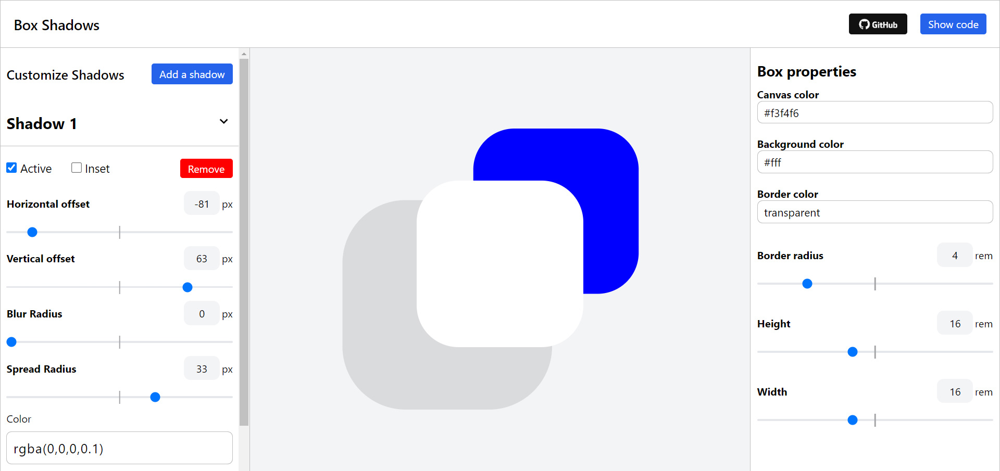
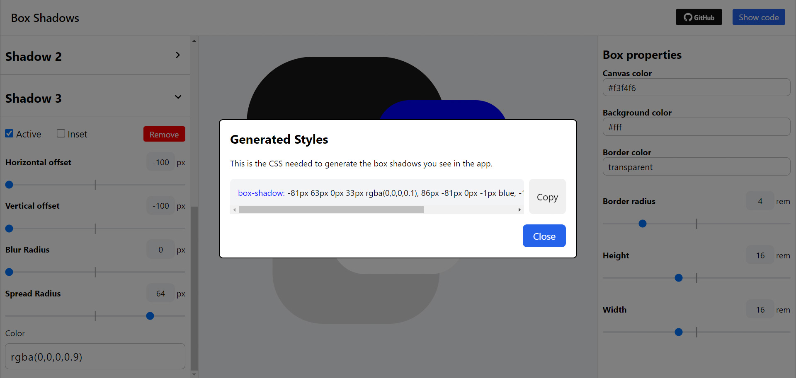

# ShadowCraft

"Introducing ShadowCraft: Your Ultimate Shadow Creation Web Tool!

Unleash your creativity with ShadowCraft, a sleek and intuitive web application designed to empower you in crafting captivating shadows effortlessly. With ShadowCraft, you have the power to customize a myriad of properties, allowing you to create shadows tailored to your exact preferences. Whether you're a design aficionado, developer, or enthusiast, ShadowCraft offers a seamless and enjoyable experience for all skill levels.

[Try online](https://narekhar666.github.io/ShadowCraft/build/index.html) or clone the repository to your local machine.

## Key Features

- Customization Galore: Adjust opacity, blur, spread, color, and more to achieve the perfect shadow effect.
- Multi-Shadow Support: Easily create and manage multiple shadows for intricate designs.
- Real-Time Preview: Instantly visualize changes as you tweak settings, ensuring precise results.
- User-Friendly Interface: Intuitive controls and a minimalist design make shadow crafting a breeze.
- Accessibility: Access ShadowCraft from any device with an internet connection, no downloads required.
- Efficient Workflow: Save time with efficient tools and streamlined processes.
- Export Options: Download your shadow configurations for seamless integration into your projects.
- Open Source: ShadowCraft is openly available on GitHub, inviting collaboration and community contributions.
- Simple copy the code that adds shadow and past it to your project.

